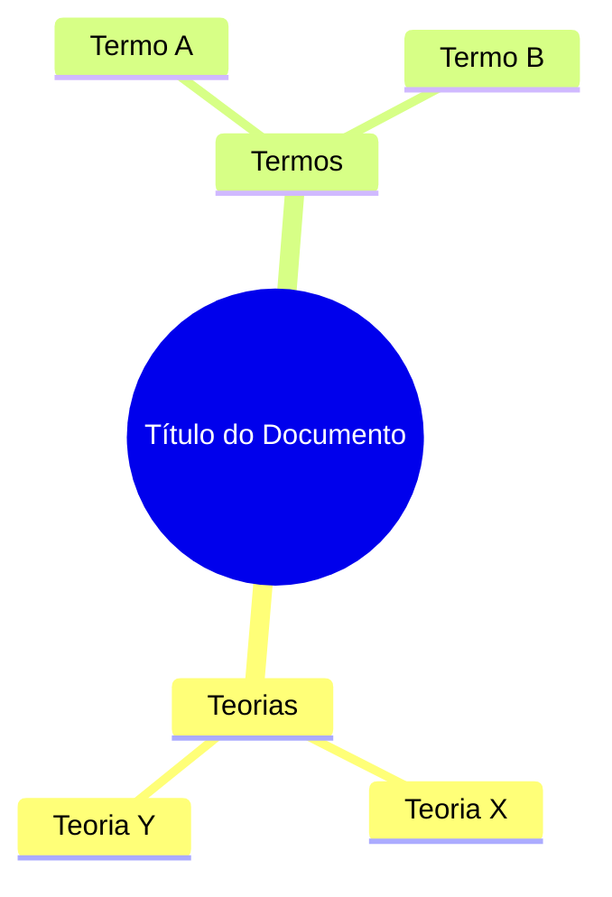

# Codex - AI Document Processor for Obsidian

Um plugin avançado para Obsidian que transforma documentos PDF em notas estruturadas e interconectadas usando inteligência artificial do Google Gemini.

## Funcionalidades

### Processamento Inteligente de PDFs
- **Extração de Texto**: Processamento robusto de PDFs usando PDF.js
- **Análise com IA**: Utiliza Google Gemini para análise semântica profunda
- **Processamento Assíncrono**: Web Workers mantêm a interface responsiva

### Geração de Conteúdo Estruturado
- **Resumos Automáticos**: Resumos executivos concisos com pontos-chave
- **Extração de Conceitos**: Identificação e categorização de conceitos importantes
- **Perguntas e Respostas**: Geração automática de Q&A educativo
- **Metadados Ricos**: Preservação de informações do documento original

### Visualizações Avançadas
- **Diagramas Mermaid**: Mapas mentais, fluxogramas, timelines e gráficos comparativos
- **Fórmulas LaTeX**: Formatação automática de expressões matemáticas
- **Ícones Integrados**: Suporte ao plugin Iconize para interface visual rica

### Interface Integrada
- **Ribbon Icon**: Acesso rápido via barra lateral
- **Command Palette**: Comandos acessíveis via Ctrl+P
- **Drag & Drop**: Detecção automática de PDFs adicionados ao vault
- **Configurações Avançadas**: Controle total sobre o processamento

## 📋 Pré-requisitos

- Obsidian v0.15.0 ou superior
- Chave da API Google Gemini (gratuita em [Google AI Studio](https://makersuite.google.com/app/apikey))

### Plugins Recomendados (Opcionais)
- **Iconize**: Para ícones nas notas
- **LaTeX Suite**: Para edição avançada de equações
- **Mermaid**: Para renderização de diagramas (geralmente já incluído)

## 🛠️ Instalação

### Instalação Manual (Recomendada para Desenvolvimento)

1. Clone ou baixe este repositório
2. Copie a pasta para `<vault>/.obsidian/plugins/obsidian-codex/`
3. Execute `npm install` na pasta do plugin
4. Execute `npm run build` para compilar
5. Ative o plugin nas configurações do Obsidian

### Via BRAT (Beta Reviewers Auto-update Tool)

1. Instale o plugin BRAT
2. Adicione este repositório: `https://github.com/seu-usuario/obsidian-codex-plugin`
3. Ative o plugin nas configurações

## Configuração

### 1. Configurar API Gemini

1. Obtenha uma chave gratuita em [Google AI Studio](https://makersuite.google.com/app/apikey)
2. Vá para Configurações → Codex
3. Cole sua chave da API no campo correspondente
4. Escolha o modelo (recomendado: Gemini 2.5 Flash)

### 2. Personalizar Saída

- **Pasta de Saída**: Defina onde as notas serão salvas
- **Conteúdo**: Escolha quais seções incluir (resumo, conceitos, Q&A)
- **Formatação**: Ative/desative diagramas, LaTeX e ícones
- **OCR**: Configure para PDFs escaneados (futuro)

## Como Usar

### Método 1: Ribbon Icon
1. Clique no ícone do Codex na barra lateral
2. Selecione um arquivo PDF
3. Aguarde o processamento
4. A nota será criada automaticamente

### Método 2: Command Palette
1. Pressione `Ctrl+P` (ou `Cmd+P` no Mac)
2. Digite "Codex" e selecione "Processar PDF"
3. Escolha o arquivo e aguarde

### Método 3: Drag & Drop
1. Arraste um PDF para seu vault
2. O Codex detectará automaticamente
3. Clique no ícone quando solicitado

## 📊 Exemplo de Saída

```markdown
---
tags: [codex-generated, pdf-processed]
created: 2024-01-15T10:30:00Z
source: documento-exemplo.pdf
author: João Silva
icon: fas-file-pdf
---

# ::fas-file-pdf:: Título do Documento

## ::fas-info-circle:: Informações do Documento

| Campo | Valor |
|-------|-------|
| **Autor** | João Silva |
| **Páginas** | 25 |
| **Data de Criação** | 15/01/2024 |

---

## ::fas-clipboard-list:: Resumo

> [!ABSTRACT] Resumo Executivo
> Este documento apresenta uma análise abrangente sobre...

### Pontos-Chave
- **Conceito principal identificado**
- **Metodologia inovadora apresentada**
- **Resultados significativos obtidos**

---

## ::fas-lightbulb:: Conceitos-Chave

### Teorias
- **Teoria X** ::fas-star::
  Descrição detalhada da teoria e sua relevância...

### Termos Técnicos
- **Termo Y** ::fas-star-half-alt::
  Definição clara e contexto de uso...

---

## ::fas-question-circle:: Perguntas e Respostas

### Questão 1 ::fas-smile::
**Qual é o conceito principal apresentado?**

> [!SUCCESS] Resposta
> O conceito principal é...

---

## ::fas-project-diagram:: Visualizações

### Mapa Mental



### Fórmulas Principais

$$E = mc^2$$

A famosa equação de Einstein relaciona energia e massa...
```

## 🔧 Desenvolvimento

### Estrutura do Projeto

```
src/
├── main.ts              # Classe principal do plugin
├── settings.ts          # Interface de configurações
├── web-worker.ts        # Processamento assíncrono
├── agents/              # Agentes especializados
│   ├── geminiClient.ts  # Cliente da API Gemini
│   ├── ingestionAgent.ts # Extração de PDF
│   └── orchestrator.ts  # Coordenação dos agentes
└── utils/               # Utilitários
    ├── markdownFormatter.ts # Formatação de saída
    ├── diagramGenerator.ts  # Geração de diagramas
    └── latexFormatter.ts    # Formatação LaTeX
```

### Scripts Disponíveis

```bash
npm run dev     # Desenvolvimento com hot reload
npm run build   # Build de produção
npm run version # Bump de versão
```

### Arquitetura

O plugin utiliza uma arquitetura multiagente:

1. **Agente de Ingestão**: Extrai texto e metadados do PDF
2. **Cliente Gemini**: Interage com a API para análise semântica
3. **Orquestrador**: Coordena o fluxo entre agentes
4. **Formatador**: Gera a saída final em Markdown

## 🤝 Contribuição

Contribuições são bem-vindas! Por favor:

1. Fork o repositório
2. Crie uma branch para sua feature (`git checkout -b feature/AmazingFeature`)
3. Commit suas mudanças (`git commit -m 'Add some AmazingFeature'`)
4. Push para a branch (`git push origin feature/AmazingFeature`)
5. Abra um Pull Request

## 📝 Roadmap

### Versão 1.1
- [ ] Suporte a OCR para PDFs escaneados
- [ ] Processamento de múltiplos arquivos
- [ ] Templates personalizáveis

### Versão 1.2
- [ ] Suporte a outros formatos (DOCX, TXT)
- [ ] Integração com outros LLMs
- [ ] Análise de sentimento

### Versão 2.0
- [ ] Interface gráfica avançada
- [ ] Colaboração em tempo real
- [ ] Integração com bases de conhecimento

## 🐛 Problemas Conhecidos

- PDFs com proteção por senha não são suportados
- Arquivos muito grandes (>50MB) podem causar lentidão
- OCR ainda não implementado

## 📄 Licença

Este projeto está licenciado sob a Licença MIT - veja o arquivo [LICENSE](LICENSE) para detalhes.

## 🙏 Agradecimentos

- Equipe do Obsidian pelo excelente framework de plugins
- Google pelo acesso à API Gemini
- Comunidade open source pelas bibliotecas utilizadas

## 📞 Suporte

- **Issues**: [GitHub Issues](https://github.com/seu-usuario/obsidian-codex-plugin/issues)
- **Discussões**: [GitHub Discussions](https://github.com/seu-usuario/obsidian-codex-plugin/discussions)
- **Discord**: Canal #plugin-dev no servidor oficial do Obsidian

---

**Desenvolvido com ❤️ por Manus AI**

